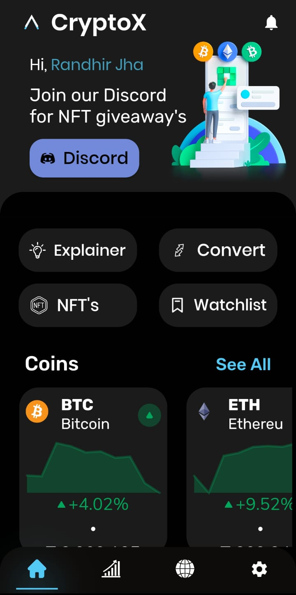
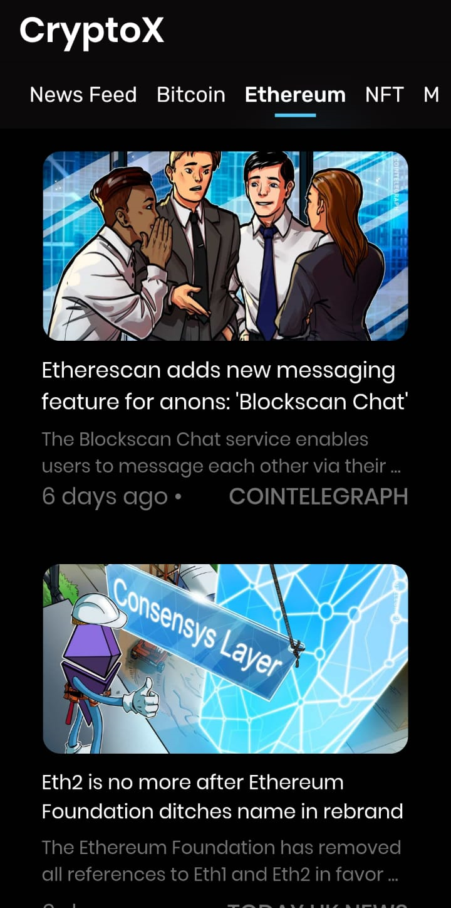
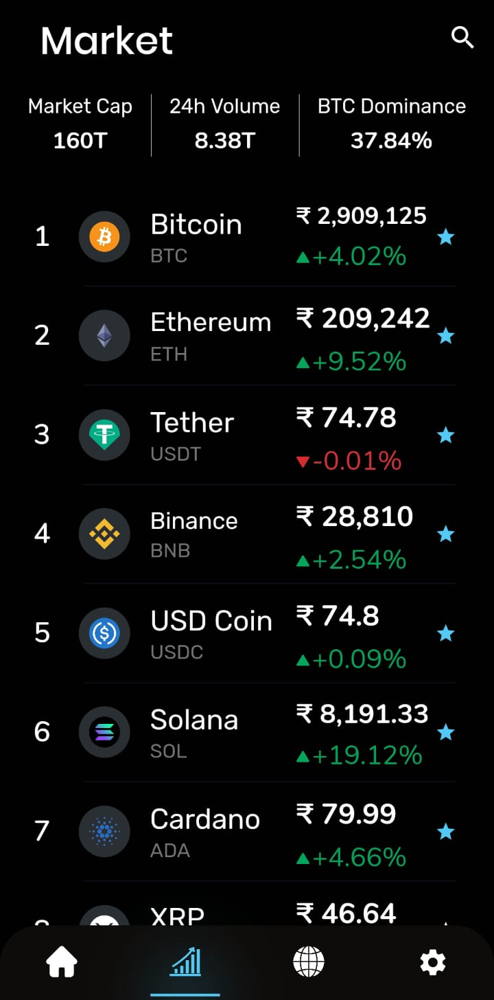
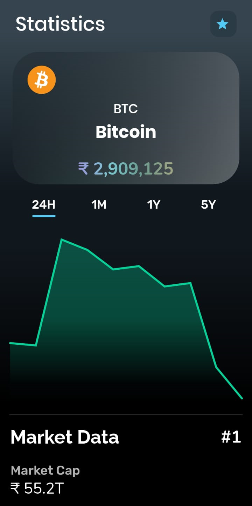
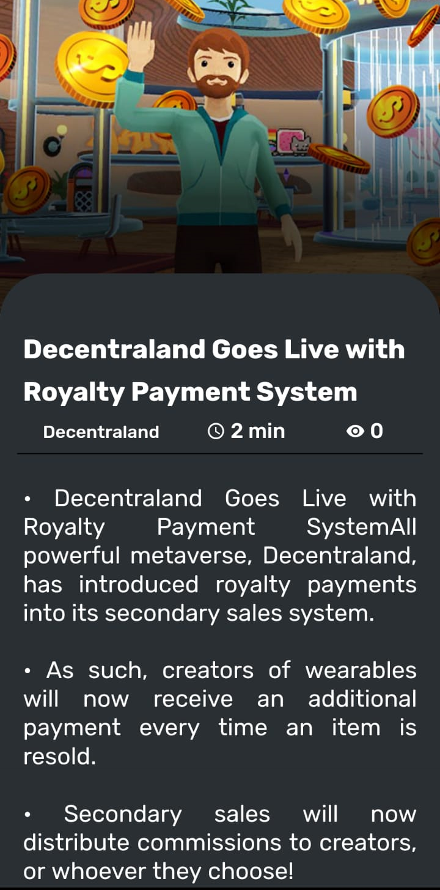
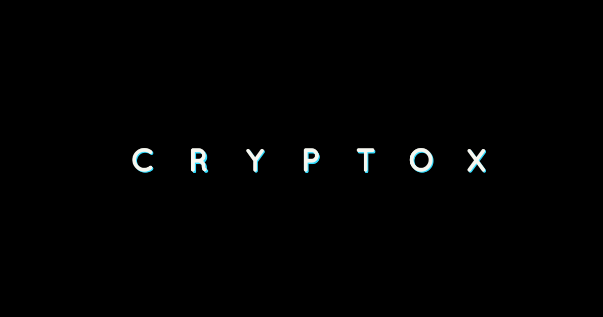

# CryptoX_Overview

CryptoX is a next-gen M.L powered blockchain news aggregator application which brings you the latest news updates from all over the globe with 50+ sources and data of more than 8000 coins. It is a collaborative between Gautam Jha and <a href="https://github.com/JayeshJain25"> Jayesh Jain. </a>

The main motive behind the app is to bring all the updates from the cryptocurrency market ranging from the latest news to price updates of thousands of coins and tokens to a single destination where one could easily stay updated with the constantly evolving space.

The team is super dedicated in making CryptoX a leading News Platform where users from all over the globe can access information. We also intend to make a complete guide within the app for beginners to enter the cryptocurrency market. The NFT section within the app will serve as a place where you could learn about NFT's from scratch. We will be actively contributing to the app after it's release as per the planned roadmap and keep it growing. We also have plans to launch it on the Apple AppStore soon.

### Here are some images of the app in the final stage of production

We are always receptive to new ideas so let's brew something up. You can write to us <a href="mailto: help.cryptox@gmail.com">help.cryptox@gmail.com</a> 
